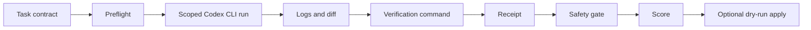

# Codex Evidence Runner

**Codex Evidence Runner** is a guarded runner for OpenAI Codex CLI. It turns an AI coding run into an auditable evidence bundle before anyone accepts or applies the patch.

Tagline: **Codex says done. Make it show the proof.**

```text
preflight -> scoped Codex run -> logs + diff -> verification -> receipt -> safety gate -> score -> optional dry-run apply
```

## Why this exists

Codex CLI can edit fast, but its final message is not proof. A useful coding agent run needs artifacts a human or another agent can inspect:

- what task was requested;
- what files changed;
- what command ran;
- what tests or checks actually returned;
- whether the patch touched allowed paths only;
- whether logs or artifacts contain secret-looking data;
- whether the diff can be applied through a dry-run gate.

This repository focuses on that narrow gap. It is not another IDE, not a multi-agent desktop, and not a replacement for Codex. It is a small evidence layer around Codex CLI.

## Who this is for

Codex Evidence Runner is for:

- developers who use Codex CLI for real repository changes;
- teams that want reviewable proof before accepting AI-generated patches;
- agent builders who need receipts, logs, diffs and safety gates;
- maintainers who want a local-first runner with no auto-commit and no production deploy path.

It is not for one-click production automation. If you want an agent to deploy, post, pay, or delete things without review, this is the wrong tool.

## What it does today

- runs Codex inside a scoped git worktree by default;
- writes an evidence bundle: `input.json`, `policy.yaml`, `prompt.md`, `codex.log`, `diff.patch`, `verify.log`, `receipt.json`, `report.md`;
- validates runner receipts;
- rejects Codex self-report without independent evidence;
- scans artifacts for secret-looking output;
- scans Codex logs for suspicious outside-project reads;
- checks changed files against allowed and forbidden paths;
- scores evidence quality from 0 to 100;
- applies diffs only through a dry-run-first gate;
- keeps generated run artifacts out of git by default.

## Operating flow



## Requirements

- Python 3.11+
- `git`
- Codex CLI for real runs: `codex`

The test suite uses only the Python standard library and a fake Codex fixture.

## Quick start

Run the local checks:

```bash
python3 -m unittest discover -s tests -p 'test_*.py' -v
python3 -m unittest discover -s workspace-repo/tests -v
```

Preview a guarded run without invoking Codex:

```bash
scripts/walter run-safe \
  --goal 'Do a bounded change.' \
  --project-path /path/to/git/project \
  --allowed-path 'src/**' \
  --allowed-path 'tests/**' \
  --verification-command 'python3 -m unittest discover -s tests -v' \
  --dry-run --print-command
```

Run for real:

```bash
scripts/walter run-safe \
  --goal 'Do a bounded change.' \
  --project-path /path/to/git/project \
  --allowed-path 'src/**' \
  --allowed-path 'tests/**' \
  --verification-command 'python3 -m unittest discover -s tests -v'
```

Inspect a run:

```bash
scripts/walter list-runs --limit 10
scripts/walter status <run-id-or-run-dir>
scripts/walter score <run-id-or-run-dir>
scripts/walter inspect <run-id-or-run-dir>
scripts/walter hygiene --limit 20
```

Apply gate:

```bash
scripts/walter apply-diff <run-id-or-run-dir>
# If CHECK_PASS and you reviewed diff.patch:
scripts/walter apply-diff <run-id-or-run-dir> --confirm
```

`apply-diff` refuses unless status is `PASS`, the safety gate is `PASS`, risk is clean, the target is a git repo, and the target checkout is clean. It never commits.

## Evidence bundle

A successful guarded run produces a folder shaped like this:

```text
runs/<timestamp-or-slug>/
  input.json
  policy.yaml
  prompt.md
  codex.log
  diff.patch
  verify.log
  receipt.json
  report.md
```

The receipt is the core object. Codex final text can be useful context, but it is not the source of truth.

## Evidence score

`score` prints a compact evidence grade:

```text
WALTER_SCORE
score: 100
grade: A
status: PASS
gate: PASS
risk: clean
```

A low score means the run should not be applied. Common reasons: missing receipt, failed verification, out-of-scope change, secret scan hit, outside-read hit, missing report, or failed gate.

## Safety boundary

Codex Evidence Runner does not:

- deploy to production;
- post or send messages from your accounts;
- handle secrets;
- manage payments or billing;
- auto-commit changes;
- run destructive cleanup without an explicit run id and confirmation.

Use it as a review gate, not as an autopilot.

## Repository hygiene

`runs/` is ignored except for `.gitkeep`. Do not commit real run logs, receipts, prompts, worktrees, credentials, local cache files, private project paths, or internal operational reports.

Generated cache files are ignored:

```text
__pycache__/
*.py[cod]
.DS_Store
```

## Current status

`v0.1.0` alpha / private staging.

The runner code, templates, fake-Codex fixtures and tests are present. The current package is intentionally small and local-first. Treat it as a preview for guarded Codex runs, not as a finished enterprise platform.

## Public links

- YouTube: https://youtube.com/@alekseiulianov
- Telegram channel - Sprut AI: https://t.me/Sprut_AI
- Telegram chat - Sprut AI: https://t.me/+eH-qNIDmud8zNDZi
- AI Operacionka: https://t.me/tribute/app?startapp=sJyg

## Canonical source

This project is maintained by Aleksei Ulianov / Sprut_AI.

Original repository: https://github.com/AlekseiUL/codex-evidence-runner

If you found this project mirrored, repackaged, or redistributed elsewhere, check this repository as the source of truth.

## Attribution

Where permitted by the applicable license, if you reuse, fork, modify, package, or publish this work, keep the original copyright and license notice and link back to the canonical repository.

## License

MIT. See `LICENSE`.

---

# Русская версия

**Codex Evidence Runner** - это безопасный runner для OpenAI Codex CLI. Он нужен для простой вещи: Codex не должен считаться закончившим работу только потому, что написал `done`.

Сначала доказательства. Потом принятие патча.

```text
preflight -> запуск Codex в ограниченном контуре -> логи и diff -> проверка -> receipt -> safety gate -> score -> apply через dry-run
```

## Зачем это нужно

В реальной работе с coding-agent быстро всплывает одна и та же боль.

Агент что-то поменял, красиво отчитался, а дальше человек всё равно должен понять:

- какие файлы он тронул;
- где diff;
- какие тесты реально запускались;
- какой был exit code;
- не полез ли он за пределы разрешённых путей;
- не попали ли в логи секреты или приватные куски;
- можно ли этот патч применить без сюрпризов.

Этот репозиторий закрывает именно этот участок. Он не заменяет Codex CLI и не пытается быть большим IDE. Это слой доказательств и проверки вокруг Codex.

## Для кого

Подойдёт тем, кто:

- использует Codex CLI для настоящих изменений в репозиториях;
- хочет принимать AI-патчи только после проверки;
- строит агентов и хочет видеть receipts, логи, diff и safety gate;
- не хочет, чтобы coding-agent сам коммитил, деплоил или трогал опасные зоны.

Не подойдёт, если нужен автопилот без проверки. Здесь наоборот: агент делает работу, runner требует доказательства.

## Что уже есть

- запуск Codex в scoped git worktree;
- evidence bundle: `input.json`, `policy.yaml`, `prompt.md`, `codex.log`, `diff.patch`, `verify.log`, `receipt.json`, `report.md`;
- проверка receipt;
- отказ принимать self-report Codex без независимых артефактов;
- scan на секретоподобные строки;
- scan логов на подозрительные чтения вне проекта;
- проверка changed files против allowed и forbidden paths;
- score качества доказательств от 0 до 100;
- apply только через dry-run-first gate;
- защита от случайного коммита реальных run-артефактов.

## Как это выглядит в работе


## Быстрый старт

Проверить сам репозиторий:

```bash
python3 -m unittest discover -s tests -p 'test_*.py' -v
python3 -m unittest discover -s workspace-repo/tests -v
```

Посмотреть команду без запуска Codex:

```bash
scripts/walter run-safe \
  --goal 'Do a bounded change.' \
  --project-path /path/to/git/project \
  --allowed-path 'src/**' \
  --allowed-path 'tests/**' \
  --verification-command 'python3 -m unittest discover -s tests -v' \
  --dry-run --print-command
```

Запустить настоящий guarded run:

```bash
scripts/walter run-safe \
  --goal 'Do a bounded change.' \
  --project-path /path/to/git/project \
  --allowed-path 'src/**' \
  --allowed-path 'tests/**' \
  --verification-command 'python3 -m unittest discover -s tests -v'
```

Посмотреть результат:

```bash
scripts/walter list-runs --limit 10
scripts/walter status <run-id-or-run-dir>
scripts/walter score <run-id-or-run-dir>
scripts/walter inspect <run-id-or-run-dir>
```

Применение diff отдельно защищено:

```bash
scripts/walter apply-diff <run-id-or-run-dir>
# После CHECK_PASS и ручного просмотра diff.patch:
scripts/walter apply-diff <run-id-or-run-dir> --confirm
```

## Что считается доказательством

Не финальный текст Codex. Доказательство - это bundle:

```text
runs/<timestamp-or-slug>/
  input.json
  policy.yaml
  prompt.md
  codex.log
  diff.patch
  verify.log
  receipt.json
  report.md
```

Если нет receipt, diff, логов проверки и понятного статуса, значит работа ещё не доказана.

## Границы безопасности

Codex Evidence Runner не делает:

- production deploy;
- отправку сообщений из ваших аккаунтов;
- работу с секретами;
- платежи и billing;
- auto-commit;
- destructive cleanup без явного run id и подтверждения.

Это review gate. Не автопилот.

## Текущий статус

`v0.1.0` alpha / private staging.

Код runner, шаблоны, fake-Codex fixtures и тесты уже есть. Репозиторий пока лучше воспринимать как preview для guarded Codex runs, а не как законченную платформу для команды.

## Полезные ссылки

- YouTube: https://youtube.com/@alekseiulianov
- Telegram-канал Sprut AI: https://t.me/Sprut_AI
- Telegram-чат Sprut AI: https://t.me/+eH-qNIDmud8zNDZi
- AI Операционка: https://t.me/tribute/app?startapp=sJyg

## Canonical source

Проект поддерживает Aleksei Ulianov / Sprut_AI.

Оригинальный репозиторий: https://github.com/AlekseiUL/codex-evidence-runner

Если вы нашли копию, mirror или переупаковку, сверяйтесь с этим репозиторием как с источником.

## Attribution

Если вы используете, форкаете, меняете, упаковываете или публикуете эту работу там, где это разрешено лицензией, сохраняйте copyright, license notice и ссылку на оригинальный репозиторий.

## License

MIT. См. `LICENSE`.
